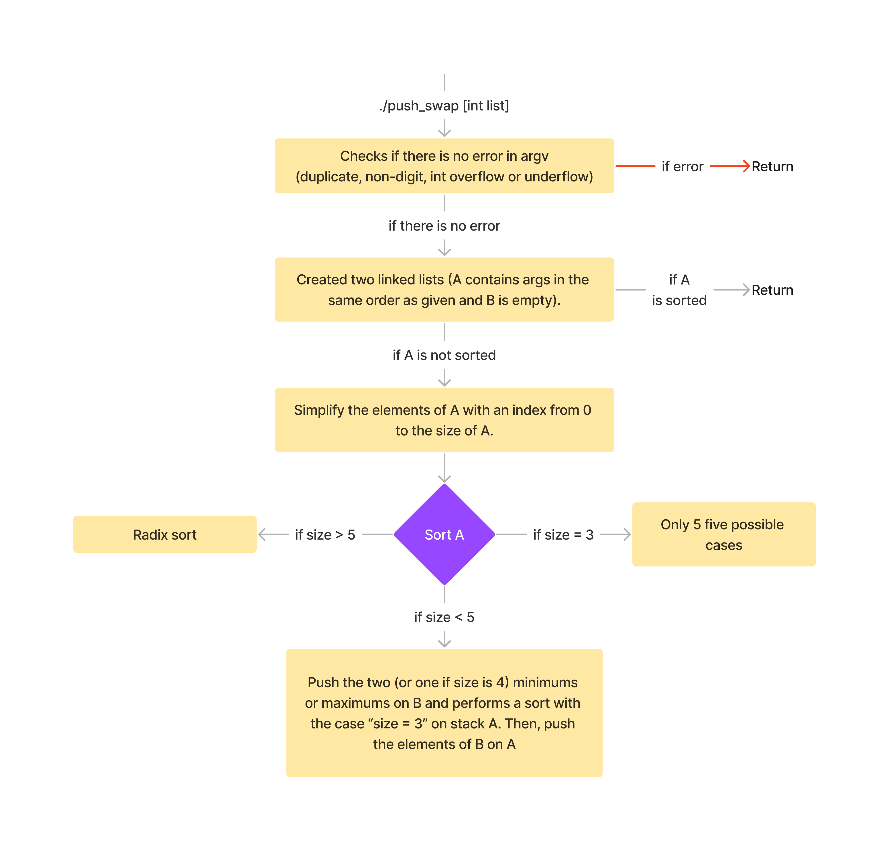
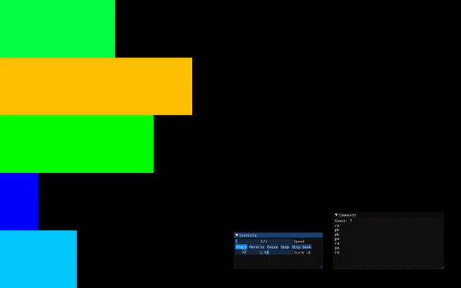

<div align="center">

# Push_swap
#### Because Swap_push isn’t as natural
[](https://forthebadge.com)

</div>

Fifth project for [42 school](https://42.fr/en/homepage/). The aim of this project is to sort data on a stack, with a limited set of instructions, using
the lowest possible number of actions.


## Subject

We have 2 stacks (named A and B) and a limited set of instructions. At the beginning, stack A contains a random amount of negative and/or positive numbers (without duplicate) and stack B is empty.
The goal is to sort in ascending order numbers into stack A.

The available instructions are as follow:

| Name | Description
| :---: | ----|
| `sa` |  Swap the first 2 elements at the top of stack a. |
| `sb` |  Swap the first 2 elements at the top of stack b. |
| `ss` | `sa` and `sb` at the same time. |
| `pa` | Take the first element at the top of b and put it at the top of a. |
| `pb` | Take the first element at the top of a and put it at the top of b. |
| `ra` |  Shift up all elements of stack a by 1. |
| `rb` |  Shift up all elements of stack b by 1. |
| `rr` | `ra` and `rb`at the salme time. |
| `rra` |  Shift down all elements of stack a by 1. |
| `rrb` |  Shift down all elements of stack b by 1. |
| `rrr` | `rra` and `rrb` at the same time. |



## The push_swap program

### Usage

```bash
make	#to compile the program
./push_swap [INT LIST]
```

### Example

```bash
./push_swap 3 5 4 1 2
```

Returns
```bash
ra
pb
pb
pa
ra
pa
ra
```



## Useful links

[Medium article - Push_Swap: The least amount of moves with two stacks](https://medium.com/@jamierobertdawson/push-swap-the-least-amount-of-moves-with-two-stacks-d1e76a71789a)
[push_swap_tester by @laisarena](https://github.com/laisarena/push_swap_tester)
[push_swap_tester by @LeoFu9487](https://github.com/LeoFu9487/push_swap_tester)
[push_swap visualizer by @o-reo](https://github.com/o-reo/push_swap_visualizer)